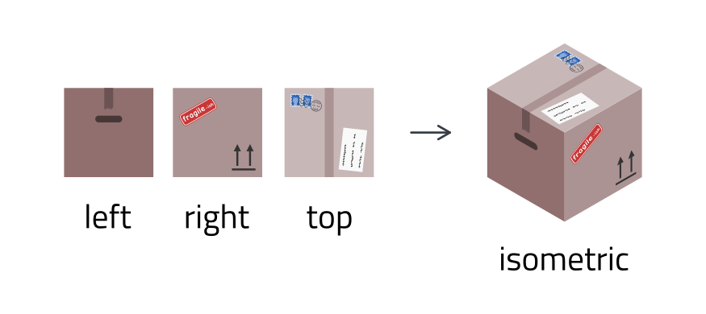
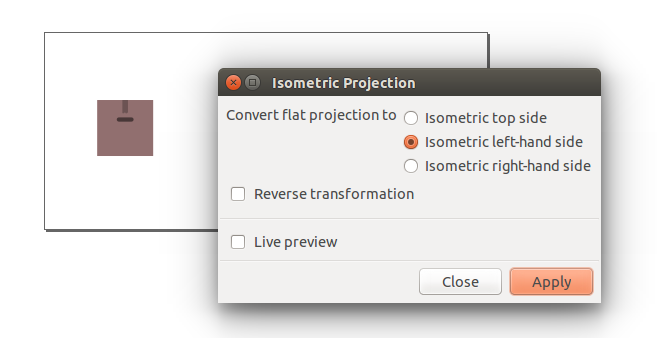

Inkscape extension: isometric projection converter
==================================================

This [Inkscape](https://inkscape.org) extension transforms objects drawn on a
two-dimensional plane to an isometric projection.

Inkscape provides an [axonometric
grid](https://en.wikipedia.org/wiki/Axonometric_projection) that by default is
configured for the [isometric
projection](https://en.wikipedia.org/wiki/Isometric_projection) (i.e., the
three axes are set at 120° angles). Drawing with this grid works quite well for
simple shapes, but sometimes it is easier to draw the details of an object
using a two-dimensional grid, and then scale, shear, and rotate the object to
set it on an isometric plane.

This extension conveniently automates these transformations.

## Installation

Copy `isometric_projection.inx` and `isometric_projection.py` to your Inkscape
extensions directory:

| OS                        | Path                                               |
| ------------------------- | -------------------------------------------------- |
| GNU/Linux & Mac OS X      | `~/.config/inkscape/extensions/`                   |
| Windows (32 bit)          | `C:\Program Files (x86)\Inkscape\share\extensions` |
| Windows (64 bit)          | `C:\Program Files\Inkscape\share\extensions\`      |

## Usage

The extension can now be found in the **Extensions** menu under `Axonometric
Projection » Isometric Projection…`. To convert a flat two-dimensional object
to one of the three visible isometric planes (i.e., top, left-hand side, and
right-hand side), select the object, and perform select the desired conversion
in the extension.

To perform the opposite action (i.e., convert from one of the isometric sides
to a flat two-dimensional object) select the appropiate isometric side, and
enable the *Reverse transformation* option.

## Further reading

More information about the transformations and maths used by this extension can 
be found in this 
[write-up](http://jeroenhoek.nl/articles/svg-and-isometric-projection.html).
